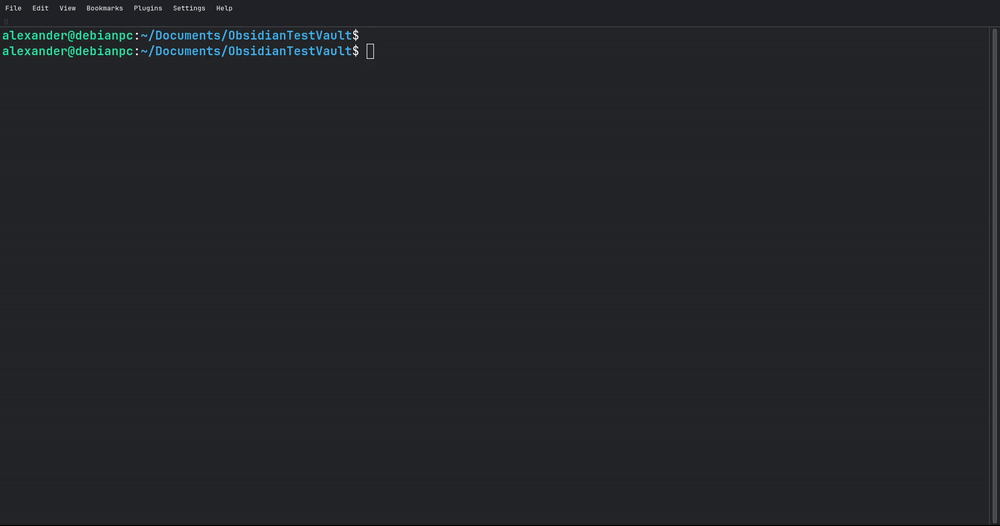

# Obsidian SQLite DB viewer

SQLite database manager and viewer for Obsidian. 

Obsidian is built on plain text files – your notes live in `.md` files.
Obsidian SQLite brings the same philosophy to structured data: one `.db` file is your database. No servers, no external dependencies, no vendor lock‑in.

Obsidian SQLite plugins uses WASM SQLite engine, allowing you query, edit, construct, and visualize massive databases without any external libraries.


## Short theory

### What is a database? How is it different from plain notes?

A database is like a super‑organized spreadsheet inside a single file. You store data in tables (rows and columns). Unlike plain notes where every file is separate, a database lets you search, filter, and combine data extremely fast – even with millions of entries.

Primary key (PK) – a special column that gives each row a unique ID (like a passport number). The database builds an invisible index on this key, so finding a row by its PK is almost instant. It also guarantees no duplicates.

### Can I use ths SQLite database outside of Obsidian?

Sure! Here is the example of viewing the same table we created in Obsidian using `sqlite3` tools.



### What is SQLite and SQL?

SQLite – the most used database engine on Earth. Every smartphone, browser, and countless apps rely on it. It’s serverless (just a file), ACID‑compliant (safe even after crashes), and tiny (<900 KB).

SQL – a simple language to talk to databases. Example:
```sql
SELECT name, price FROM Products WHERE price < 100;
```

Obsidian SQLite DB viewer executes your SQL statements directly on the `.db` file and shows you the results.

### Comparison with other plugins

- `Dataview` – queries frontmatter and inline fields inside your notes using DQL. It does not allow editing and is read‑only.
- `Obsidian Bases` (built‑in) – gives you a spreadsheet‑like interface for frontmatter fields, no coding required. Works only with note properties.
- `DB Folder` – also a graphical interface for editing YAML frontmatter across many notes, with two‑way sync.
- `SQLSeal` – lets you run SQL queries over files, CSV, JSON, and tasks, but it uses its own custom engine, not a real SQLite database.
- `sqliteDB` by `stfrigerio` – focuses on querying and visualization. You write queries using a structured YAML-like syntax inside code blocks, supports chart generation (pie, line, bar), multiple filters, date ranges, table inspection, and exporting rows as notes. It can work with a local database file or a remote API, and has integrations for daily notes (dump journal entries into your DB and vice versa). However, it uses a custom syntax instead of raw SQL and requires manually downloading a .wasm file.
- `SQLite Explorer` by `qf3l3k` – a dedicated browser view for SQLite files. You open any `.db` file from your vault in a special tab where you can browse tables, inspect schema, and run read‑only SQL queries. It supports embedding query results as table, list, or a single value inside notes. It is read‑only by design – no changes are ever written back to the database file.

Obsidian SQLite combines the best of both worlds – it works with real SQLite `.db` files, supports full SQL (joins, aggregations, views), allows inline editing of table data that persists directly to the database file, and provides a visual table constructor and SQL terminal. Use it when you need a true, fully editable database inside Obsidian.

### Important

- **Backup your vault** – the plugin writes directly to `.db` files. Database is not a backup system.
- Destructive queries (`DELETE`, `DROP`) are permanent – double‑check.
- Large databases (> 1 GB) may affect performance. Yes, pagination with `LIMIT` and `OFFSET` is transfering only small portions of data to the renderer but the entire database file is still loaded into the memory (500 MB db file takes ~500 MB of RAM). Use external SQLite tools (like DB Browser for SQLite) for massive files, and only export subsets to Obsidian.

## Features

- Runs entirely locally using `sql.js` (WASM).
- Edit database rows directly from your Obsidian notes. Changes are instantly written to your `.db` file.
- Seamlessly render Obsidian links (`[[Note]]`), bold text, and highlights directly inside database cells.
- Click on any `.db` or `.sqlite` file in your vault to open the dedicated Database Explorer workspace.
- Create tables, define primary keys, and add columns using a visual UI, no SQL knowledge required.
- Instantly convert Obsidian Markdown tables into relational SQLite tables.

## Usage

There are two ways to render your databases inside your notes: **Embeds** and **Codeblocks**.
Three extensions are supported for db files: `.db`, `.sqlite` and `.sqlite3`.
 
To render table using codeblocks use one of the following codenames: `db-query`, `sqlite-query`, `sqlite3-query`:
```sqlite-query
db: test.db
SELECT *
FROM demo_table
```

To render table using embed files use following format:
```md
![[test.db | SELECT * FROM table]]
```

## Installation

From the Obsidian Community Plugins
* Open `Obsidian Settings > Community Plugins`.
* Click "Browse" and search for `sqlite-db-viewer`.
* Install and Enable the plugin.

Manual Installation
* Download the latest release (`main.js`, `manifest.json`, `styles.css`) from the Releases page.
* Place all files inside your vault at .obsidian/plugins/obsidian-sqlite/.
* Reload Obsidian and enable the plugin in Settings.

## Development

If you want to build this plugin locally:
```bash
npm install

npm run build    # To build for production
npm run dev      # To start compilation in watch mode
npm run format   # To prettier formatter
npm run lint     # To lint
npm run test     # To run the Jest test suite
```

### Contributing

* Create your branch: `git branch feature/new-buttons`
* Switch to your branch: `git switch feature/new-buttons`
* Write your code, and test it locally.
* Update version in `package.json`.
* Update the `CHANGELOG.md` file while you are still in your branch.
* Commit and push your branch to GitHub.
* Open a Pull Request (PR) into main.
* Wait for the CI Pipeline to run your Linter, Prettier formatting check, and Jest tests.
* Once the CI turns green wait for approval and merge.
