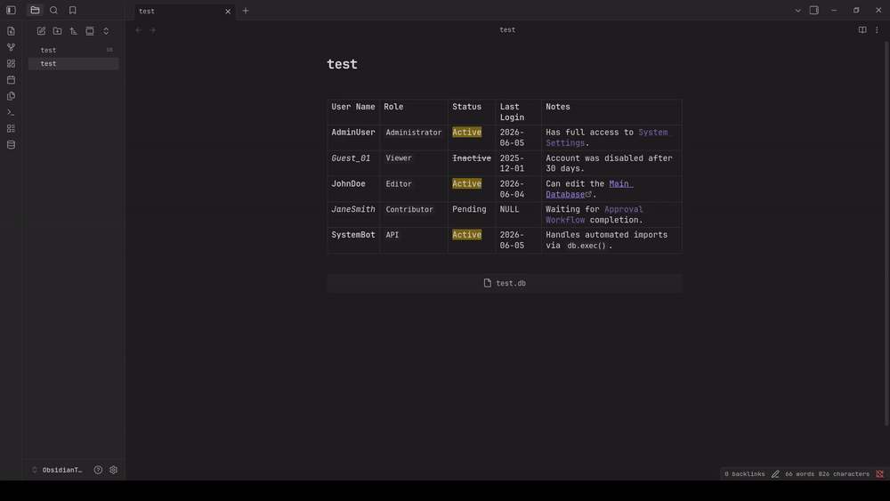

# Obsidian SQLite DB viewer

SQLite database manager and viewer for Obsidian. 

Obsidian is built on plain text files – your notes live in `.md` files.
Obsidian SQLite brings the same philosophy to structured data: one `.db` file is your database. No servers, no external dependencies, no vendor lock‑in.

Obsidian SQLite plugins uses WASM SQLite engine, allowing you query, edit, construct, and visualize massive databases without any external libraries.



## Features

- Runs entirely locally using `sql.js` (WASM). No external servers, no cloud APIs, 100% offline.
- Edit database rows directly from your Obsidian notes. Changes are instantly written to your `.db` file.
- Seamlessly render Obsidian links (`[[Note]]`), bold text, and highlights directly inside database cells.
- Click on any `.db` or `.sqlite` file in your vault to open the dedicated Database Explorer workspace.
- Create tables, define primary keys, and add columns using a visual UI, no SQL knowledge required.
- Instantly convert Obsidian Markdown tables into relational SQLite tables.

## Usage

There are two ways to render your databases inside your notes: **Embeds** and **Codeblocks**.
Three extensions are supported for db files: `.db`, `.sqlite` and `.sqlite3`.
 
To render table using codeblocks use one of the following codenames: `db-query`, `sqlite-query`, `sqlite3-query`:
```sqlite-query
db: test.db
SELECT *
FROM demo_table
```

To render table using embed files use following format:
```md
![[test.db | SELECT * FROM table]]
```

## Installation

From the Obsidian Community Plugins
* Open `Obsidian Settings > Community Plugins`.
* Click "Browse" and search for `sqlite-db-viewer`.
* Install and Enable the plugin.

Manual Installation
* Download the latest release (`main.js`, `manifest.json`, `styles.css`) from the Releases page.
* Place all files inside your vault at .obsidian/plugins/obsidian-sqlite/.
* Reload Obsidian and enable the plugin in Settings.

## Development

If you want to build this plugin locally:
```bash
npm install

npm run build    # To build for production
npm run dev      # To start compilation in watch mode
npm run format   # To prettier formatter
npm run lint     # To lint
npm run test     # To run the Jest test suite
```

### Contributing

* Create your branch: `git branch feature/new-buttons`
* Switch to your branch: `git switch feature/new-buttons`
* Write your code, and test it locally.
* Update version in `package.json`.
* Update the `CHANGELOG.md` file while you are still in your branch.
* Commit and push your branch to GitHub.
* Open a Pull Request (PR) into main.
* Wait for the CI Pipeline to run your Linter, Prettier formatting check, and Jest tests.
* Once the CI turns green wait for approval and merge.
